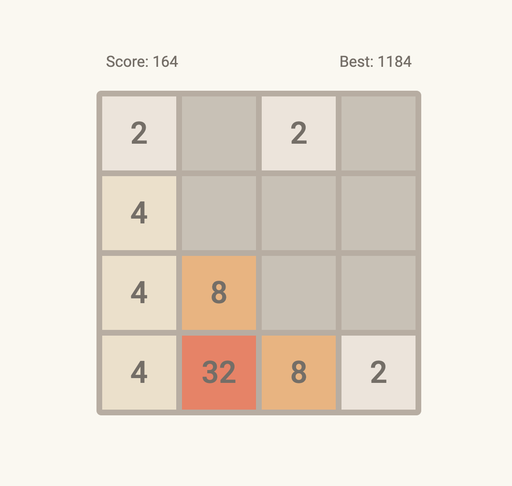

+++
title = '2048'
date = 2024-02-01T13:52:17-08:00
draft = false
description = "2048 Game"
image = "/images/javascript_icon.webp"
imageBig = "/images/javascript_icon.webp"
categories = ["javascript", "html", "css"]
authors = ["Crux Cook"]
avatar = "/images/avatar.webp"
projSrc = "https://github.com/cruxcook/2048"
+++

> Developed in [Vanilla JavaScript](https://www.javascript.com/), [HTML](https://www.w3schools.com/html/) & [CSS](https://www.w3schools.com/css/)

## Contents

-   [Project Configuration](#1-project-configuration)

---

### 1. Project Configuration

-   JavaScript: 1.5