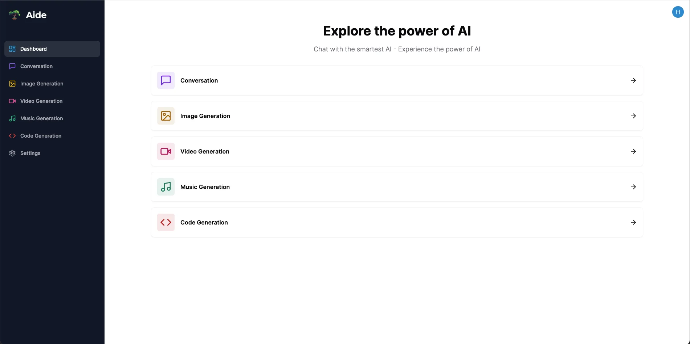

+++
title = 'Aide'
date = 2024-02-05T15:35:39-08:00
draft = false
description = "AI Platform - OpenAI"
image = "/images/typescript_icon.webp"
imageBig = "/images/typescript_icon.webp"
categories = ["nextjs", "tailwindcss", "typescript", "shadcn-ui", "clerk-auth"]
authors = ["Crux Cook"]
avatar = "/images/avatar.webp"
projSrc = "https://github.com/cruxcook/aide"
deployment = "https://aide-tau.vercel.app/"
+++


> Developed in [Next.js](https://nextjs.org/), [Tailwind CSS](https://tailwindcss.com/), [TypeScript](https://www.typescriptlang.org/), [Shadcn/UI](https://ui.shadcn.com/), [Clerk](https://clerk.com/).

## Contents

-   [Prerequisites](#1-prerequisites)
-   [Features](#2-features)
-   [Usage](#3-usage)

---

### 1. Prerequisites

-   [Node.js](https://nodejs.org/en) - v21.x.x

### 2. Features



- Tailwind design.
- Tailwind animations and effects.
- Full responsiveness.
- Clerk Authentication (Email, GMail).
- Client form validation and handling using [react-hook-form](https://react-hook-form.com/).
- Page loading state.
- Conversation Generation Tool (Open AI).
- Code Generation Tool (Open AI)
- Image Generation Tool (WIP)
- Music Generation Tool (WIP)
- Video Generation Tool (WIP)

### 3. Usage

- Clone the repo

```bash
git clone https://github.com/cruxcook/aide.git
```

- Set up environment

```bash
cp .emv.example .emv
```

- Configure environment

```bash
NEXT_PUBLIC_CLERK_PUBLISHABLE_KEY=
CLERK_SECRET_KEY=

NEXT_PUBLIC_CLERK_SIGN_IN_URL=/sign-in
NEXT_PUBLIC_CLERK_SIGN_UP_URL=/sign-up
NEXT_PUBLIC_CLERK_AFTER_SIGN_IN_URL=/dashboard
NEXT_PUBLIC_CLERK_AFTER_SIGN_UP_URL=/dashboard

OPENAI_API_KEY=
```

- Start the app

```bash
npm run dev
```