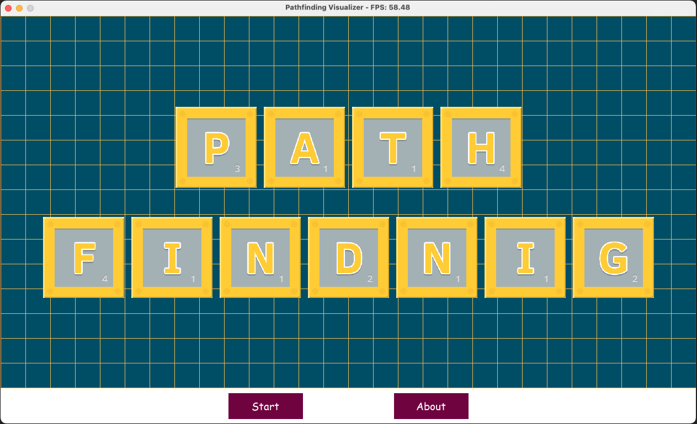
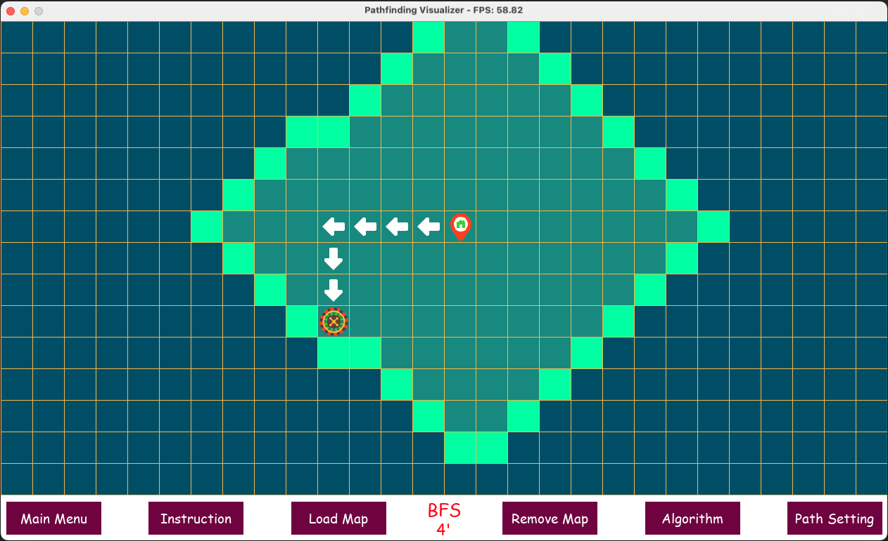
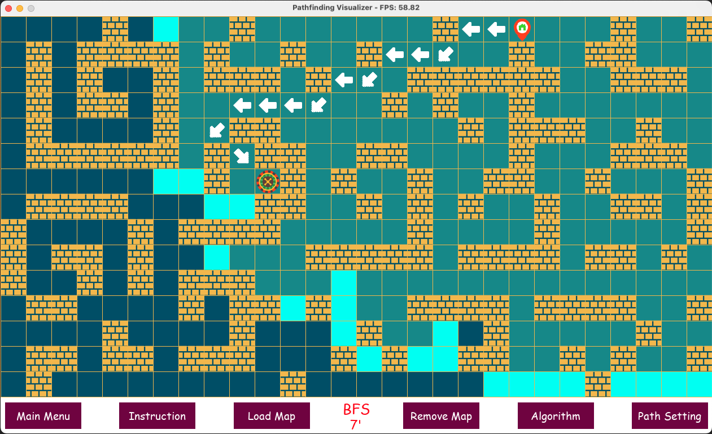

+++
title = 'Pathfinding Visualizer'
date = 2024-01-02T16:44:33-08:00
draft = false
description = "Pathfinding Visualizer"
image = "/images/python_icon.webp"
imageBig = "/images/python_icon.webp"
categories = ["python", "pygame"]
authors = ["Crux Cook"]
avatar = "/images/avatar.webp"
projSrc = "https://github.com/cruxcook/pathfinding-visualizer"
+++



> Developed in [Pygame](https://www.pygame.org/wiki/GettingStarted) (REQUIRED)

## Contents

-   [Project Configuration](#1-project-configuration)
-   [Features](#2-features)
-   [Usage](#3-usage)

---

### 1. Project Configuration

-   pygame: 2.5.2

### 2. Features

Visualizes Pathfinding algorithms.

#### Straight Path



#### Diagonal Path



### 3. Usage

To run the project (macOS):

```shell
$ python3 main.py
```
