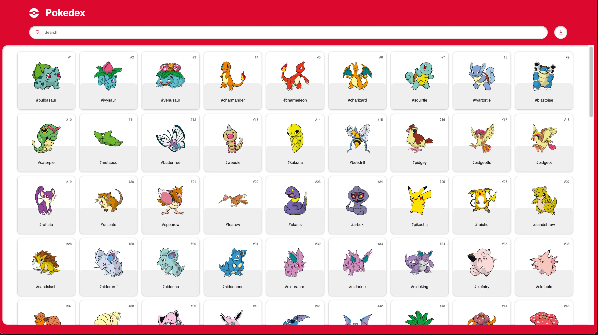

+++
title = 'Pokedex'
date = 2024-01-22T18:39:50-08:00
draft = false
description = "Pokemon Information."
image = "/images/javascript_icon.webp"
imageBig = "/images/javascript_icon.webp"
categories = ["javascript", "html", "css"]
authors = ["Crux Cook"]
avatar = "/images/avatar.webp"
projSrc = "https://github.com/cruxcook/pokedex"
+++

> Developed in [Vanilla JavaScript](https://www.javascript.com/), [HTML](https://www.w3schools.com/html/) & [CSS](https://www.w3schools.com/css/)

## Contents

-   [Project Configuration](#1-project-configuration)
-   [Features](#2-features)

---

### 1. Project Configuration

-   JavaScript: 1.5

### 2. Features

- Search Pokemon by Number or Name
- Display Pokemon detail

