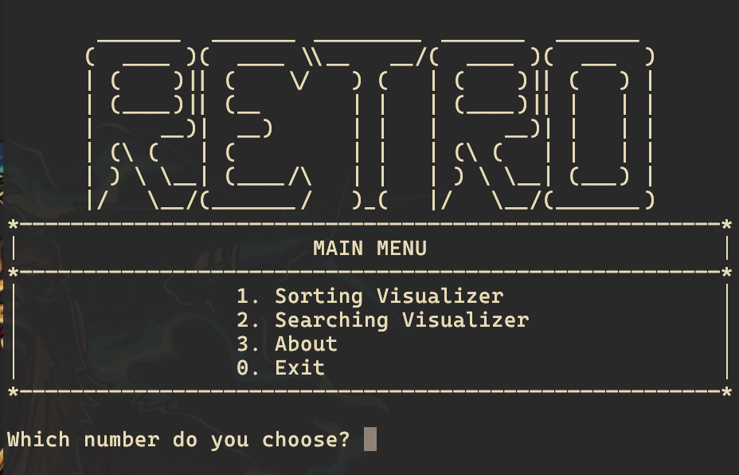

+++
title = 'Retro Visualizer'
date = 2023-12-14T16:44:33-08:00
draft = false
description = "Sorting/Searching Visualizer"
image = "/images/cpp_icon.webp"
imageBig = "/images/cpp_icon.webp"
categories = ["c++"]
authors = ["Crux Cook"]
avatar = "/images/avatar.webp"
projSrc = "https://github.com/cruxcook/retro-visualizer"
+++



> Developed in [GCC](https://gcc.gnu.org/) (REQUIRED)

## Contents

-   [Project Configuration](#1-project-configuration)
-   [Features](#2-features)
-   [Usage](#3-usage)

---

### 1. Project Configuration

-   GCC: 15.0.0

### 2. Features

Visualizes Sorting and Searching algorithms.

### 3. Usage

To compile and build the project:

```shell
$ make
```

After that, we can run the project:

```shell
$ make run

# or 

$ ./retro
```

To clean or rebuild the project:

```shell
$ make clean; make

# or

$ make rebuild
```